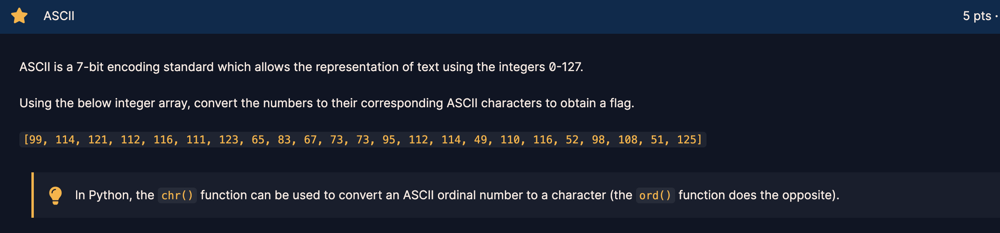
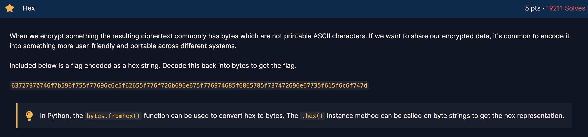
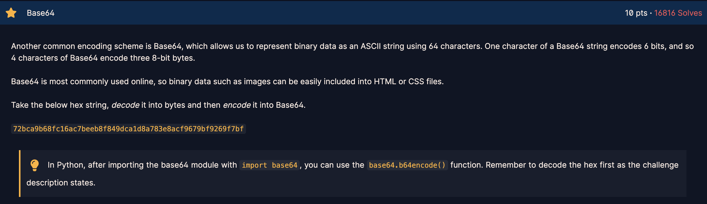
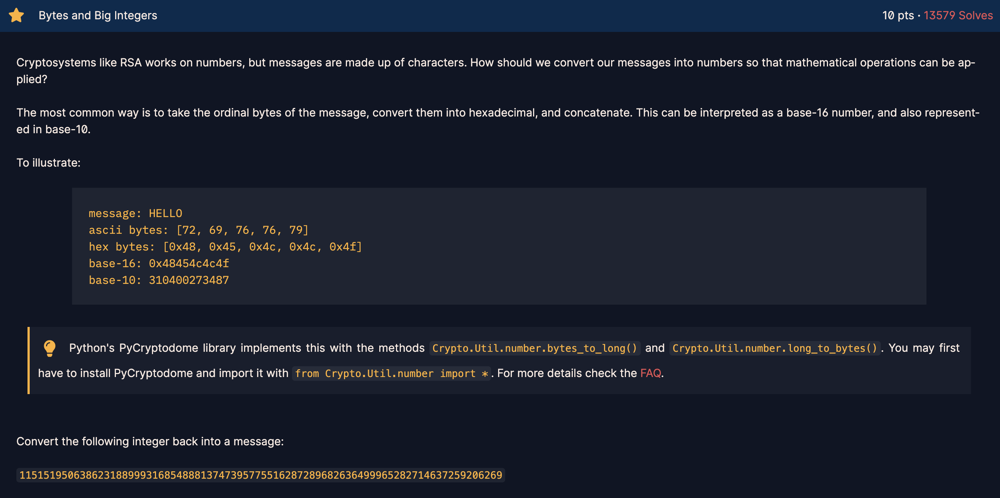
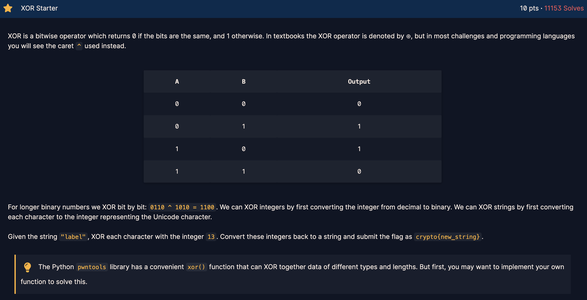
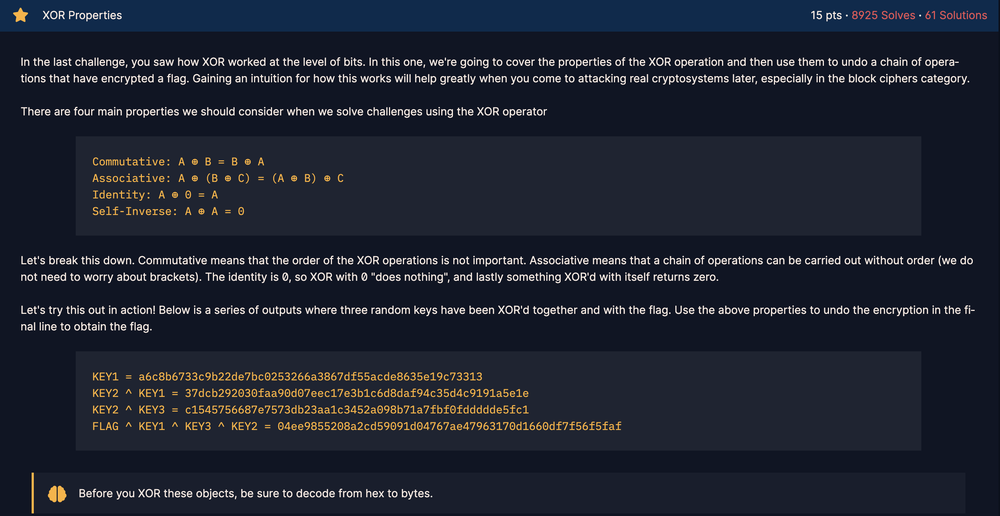
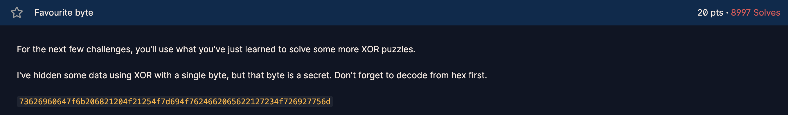
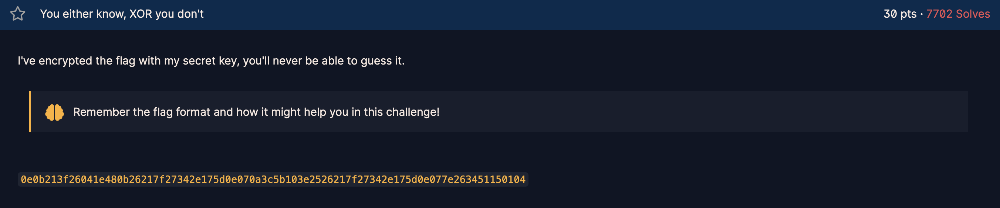

##ASCII

A rather simple challenge, and the hint being the use of chr() or ord() function in Python.

Solution:

```python
flag = [99, 114, 121, 112, 116, 111, 123, 65, 83, 67, 73, 73, 95, 112, 114, 49, 110, 116, 52, 98, 108, 51, 125]
for f in flag:
	print(chr(f), end = '')
print("\n")
```

Flag:
**crypto{ASCII_pr1nt4bl3}**

##HEX

Another simple challenge with the hint being given that to change hex into bytes or vice versa, we can use bytes.fromhex() or .hex() methods respectively.

Solution:

```python
#Convert hex to bytes
flag = "63727970746f7b596f755f77696c6c5f62655f776f726b696e675f776974685f6865785f737472696e67735f615f6c6f747d"
flag_bytes = bytes.fromhex(flag)
for f in flag_bytes:
	print(chr(f), end = '')
print("\n")

flag = "72bca9b68fc16ac7beeb8f849dca1d8a783e8acf9679bf9269f7bf"
```

Flag:
**crypto{You _ will _ be _ working _ with _ hex _ strings _ a _ lot}**

##Base64

For this challenge, we need to decode a given string to hex and then encode it into Base64.

Solution:

```python
#Encoding to base64
import base64
flag_bytes = bytes.fromhex(flag)
flag_encoded = base64.b64encode(flag_bytes)
for f in flag_encoded:
	print(chr(f), end = '')
print("\n")
```

Flag:
**crypto/Base+64+Encoding+is+Web+Safe/**

##Bytes and Big Integers

For this challenge, given a long, we need to convert it into hex bytes, followed by ascii. This would require a recap of our first challenge!

Solution:

```python
#Convert integers (base-10) to hexadecimal (base-16)
import Crypto.Util.number
flag_long = 11515195063862318899931685488813747395775516287289682636499965282714637259206269
flag_hex = Crypto.Util.number.long_to_bytes(flag_long)
for f in flag_hex:
	print(chr(f), end = '')
print("\n")
```

Flag:
**crypto{3nc0d1n6_ 4ll _ 7h3 _ w4y _ d0wn}**

##XOR Starter

This challenge teaches us how to use XOR, which is commonly used in encryption schemes for cryptographic challenges.

Solution:

```python
flag_string = "label"
for f in flag_string:
	f_int = ord(f)
	f_xor = f_int ^ 13
	print(chr(f_xor), end = '')
print("\n")
```

Flag:
**aloha**

##XOR Properties

This challenge teaches us the associative properties of XOR, which can be vital if you see a lot of XOR operations on a cryptographic functions, when it can be further simplified having these knowledge.

The key here is that to get the flag, we simply XOR the final hex with key1 hex and key2 ^ key3 hex to cancel out all 3 keys to get the flag!

For the solution, I would like to introduce the pwn library, which allows you to XOR bytes instead of using ^, which does not allow you to XOR 2 bytes.

Solution:

```python
from pwn import xor
key1 = bytes.fromhex("a6c8b6733c9b22de7bc0253266a3867df55acde8635e19c73313")
key2_xor_key3 = bytes.fromhex("c1545756687e7573db23aa1c3452a098b71a7fbf0fddddde5fc1")
flag_xor_keys = bytes.fromhex("04ee9855208a2cd59091d04767ae47963170d1660df7f56f5faf")
flag = xor(flag_xor_keys, xor(key1, key2_xor_key3))
for f in flag:
	print(chr(f), end = '')
print("\n")
```

Flag:
**crypto{x0r _ i5 _ ass0c1at1v3}**

##Favourite Byte

For this challenge, we know that we have a secret byte to XOR with the string in order to get the flag. The secret byte is a single byte, which is 8 bits, giving us a total of (2^8 - 1) or 255 combinations, out of which one is our secret byte. Hence, solving this challenge requires some bruteforcing.

Solution:

```python
flag_hex = "73626960647f6b206821204f21254f7d694f7624662065622127234f726927756d"
flag_bytes = bytes.fromhex(flag_hex)
for i in range(256):
	flag = ""
	for f in flag_bytes:
		flag_b = xor(f, i)
		flag += flag_b.decode()
	if "crypto" in flag:
		print("Secret Byte: ", i)
		print(flag)
		break
```

To change byte to ascii, we can use the .decode method

Flag:
**crypto{0x10 _ 15 _ my _ f4v0ur173 _ by7e}**

Bonus (Secret byte): **16**

##You either know, XOR you don't

This is a rather tricky challenge, the only clue present is that we just need to know the flag format. And based on the title, the only way to get it is through XOR operations.

Since the flag format is crypto{}, we can derive the first 7 characters of the XOR at the very least.

Once that is done, we get the partial key being "myXORke". Slightly guessy, but we can assume the key is incomplete, and likely to be "myXORkey", which contains a total of 8 characters.

Since the ciphertext is in hex and has a total of 84 characters, the total characters in ASCII, will be 42. Assuming the key repeats itself, and it is a one-time pad encryption, the key of 42 characters length will be "myXORkeymyXORkeymyXORkeymyXORkeymyXORkeymy"

Solution:

```python
ciphertext = "0e0b213f26041e480b26217f27342e175d0e070a3c5b103e2526217f27342e175d0e077e263451150104"
ciphertext_bytes = bytes.fromhex(ciphertext)
partial_key = "crypto{".encode()
xor_partial = xor(ciphertext_bytes[:7], partial_key)

key = "myXORkeymyXORkeymyXORkeymyXORkeymyXORkeymy".encode()
xor_plaintext = xor(key, ciphertext_bytes)
print(xor_plaintext.decode())
```

Flag: **crypto{1f _ y0u _ Kn0w _ En0uGH _ y0u _ Kn0w _ 1t _ 4ll}**